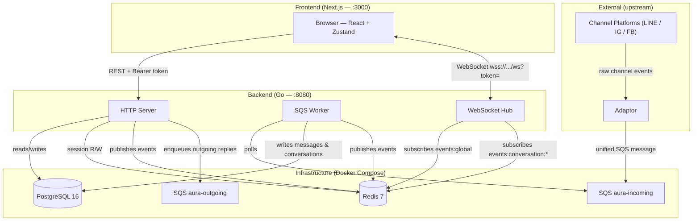
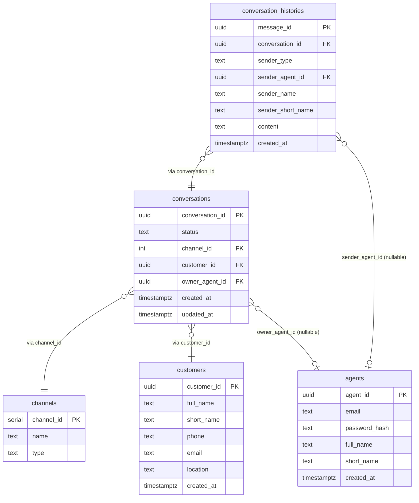
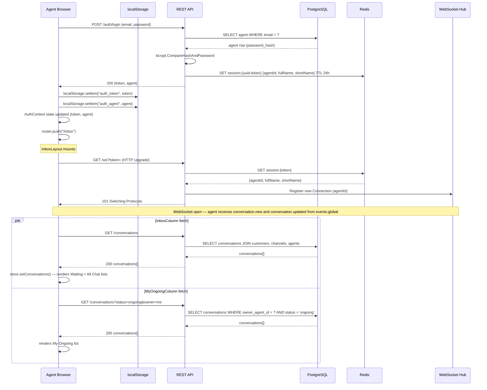
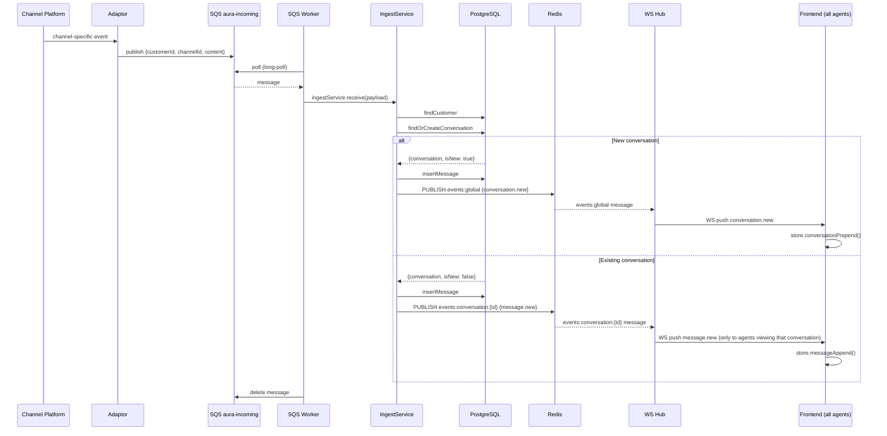
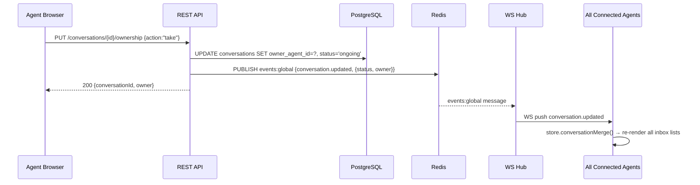
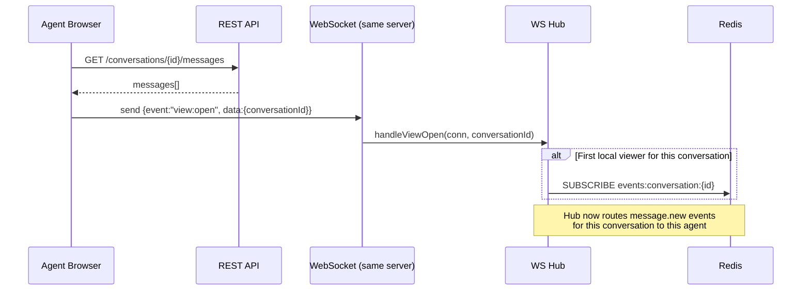
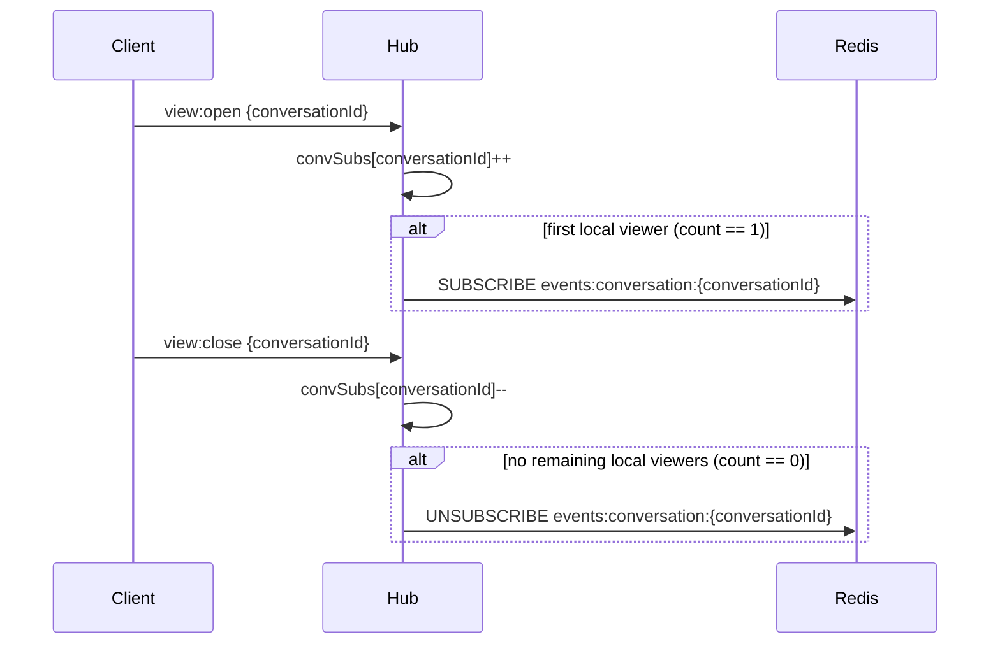
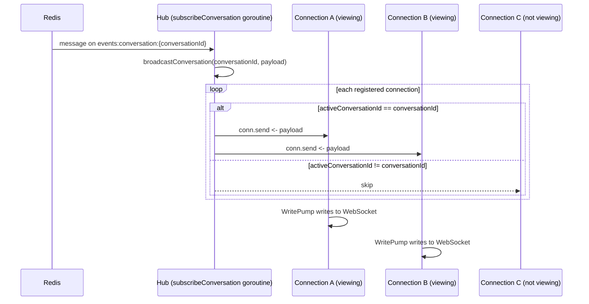

# System Architecture

## Table of Contents

- [Container Overview](#container-overview)
- [Database Schema](#database-schema)
- [Redis Key Space](#redis-key-space)
- [REST API Summary](#rest-api-summary)
- [WebSocket Event Summary](#websocket-event-summary)
- Sequence Diagrams
  - [Sequence: Agent Login](#sequence-agent-login)
  - [Sequence: Incoming Customer Message](#sequence-incoming-customer-message)
  - [Sequence: Agent Takes Ownership](#sequence-agent-takes-ownership)
  - [Sequence: Agent Opens a Conversation](#sequence-agent-opens-a-conversation)
  - [Sequence: WS Hub — view:open / view:close Handling](#sequence-ws-hub--viewopen--viewclose-handling)
  - [Sequence: WS Hub — Incoming message.new](#sequence-ws-hub--incoming-messagenew)
- [Redis Channel Partitioning — Design Comparison](#redis-channel-partitioning--design-comparison)

---

## Container Overview



---

## Database Schema



---

## Redis Key Space

| Key pattern | Type | TTL | Purpose |
|---|---|---|---|
| `session:{token}` | Hash (`agentId`, `fullName`, `shortName`) | 24 h | Auth session store |
| `events:global` | Pub/Sub channel | — | `conversation.new`, `conversation.updated` — broadcast to all agents |
| `events:conversation:{id}` | Pub/Sub channel | — | `message.new` — delivered only to Hub instances with an active viewer |

---

## REST API Summary

| Method | Path | Auth | Description |
|---|---|---|---|
| `POST` | `/auth/login` | — | Authenticate agent; returns token + agent identity |
| `POST` | `/auth/logout` | Bearer | Invalidate session token |
| `GET` | `/conversations` | Bearer | List conversations (filter: status, channel, search, owned_by) |
| `GET` | `/conversations/{id}` | Bearer | Get single conversation metadata |
| `PUT` | `/conversations/{id}/ownership` | Bearer | Take or release ownership |
| `GET` | `/conversations/{id}/messages` | Bearer | Get message thread |
| `POST` | `/conversations/{id}/messages` | Bearer | Send a reply (enqueues to SQS outgoing) |
| `GET` | `/customers/{id}` | Bearer | Get customer profile |
| `GET` | `/channels` | Bearer | List connected channels |
| `GET` | `/ws` | token query param | Upgrade to WebSocket |
| `GET` | `/health` | — | Health check |

---

## WebSocket Event Summary

### Server → Client

All events share the envelope `{ "event": "string", "data": {} }`.

#### `conversation.new`
Trigger: new conversation created via ingest. Delivered to all connected agents.
```json
{
  "event": "conversation.new",
  "data": {
    "conversationId": "uuid",
    "status": "waiting | ongoing",
    "channel": "LINE | IG | FB",
    "customer": { "customerId": "uuid", "fullName": "string", "shortName": "string" },
    "owner": { "agentId": "uuid", "fullName": "string", "shortName": "string" },
    "lastMessage": { "preview": "string", "timestamp": "ISO 8601" }
  }
}
```
> `owner` is `null` when `status` is `"waiting"`.

#### `conversation.updated`
Trigger: ownership change or status change. Delivered to all connected agents.
```json
{
  "event": "conversation.updated",
  "data": {
    "conversationId": "uuid",
    "changes": {
      "status": "waiting | ongoing",
      "owner": { "agentId": "uuid", "fullName": "string", "shortName": "string" },
      "lastMessage": { "preview": "string", "timestamp": "ISO 8601" }
    }
  }
}
```
> Only changed fields are included in `changes`. `owner` may be `null` to indicate ownership was released.

#### `message.new`
Trigger: new message in a conversation. Delivered only to agents with that conversation open.
```json
{
  "event": "message.new",
  "data": {
    "conversationId": "uuid",
    "message": {
      "messageId": "uuid",
      "sender": { "type": "agent | customer", "fullName": "string", "shortName": "string" },
      "content": "string",
      "timestamp": "ISO 8601"
    }
  }
}
```

### Client → Server

| Event | Payload | Effect |
|---|---|---|
| `view:open` | `{conversationId}` | Hub subscribes to `events:conversation:{id}` if no other local viewer |
| `view:close` | `{conversationId}` | Hub unsubscribes from `events:conversation:{id}` if no remaining local viewers |

---

## Sequence: Agent Login



---

## Sequence: Incoming Customer Message



---

## Sequence: Agent Takes Ownership



---

## Sequence: Agent Opens a Conversation



---

## Sequence: WS Hub — view:open / view:close Handling



---

## Sequence: WS Hub — Incoming message.new



---

## Redis Channel Partitioning — Design Comparison

Full analysis: [`requirements/current/system_designs/redis_channel_partition.md`](requirements/current/system_designs/redis_channel_partition.md)

### Context

With the introduction of `business_units` (an agent belongs to multiple BUs; a message belongs to one BU; an agent can view all and only messages from their BUs), the choice of Redis Pub/Sub channel granularity becomes a meaningful architectural decision.

Two schemes are compared:

- **A — Conversation-scoped:** `events:conversation:{conversation_id}` (current implementation)
- **B — BU-scoped:** `events:bu:{bu_id}`

### Summary

| Dimension | A — Conversation-scoped | B — BU-scoped |
|---|---|---|
| Subscription lifecycle | Dynamic (view:open / view:close) | Static (connect / disconnect) |
| Active Redis channels | Up to N viewed conversations | Up to N BUs (small, fixed) |
| SUBSCRIBE/UNSUBSCRIBE churn | Every conversation open/close | Only on agent connect/disconnect |
| Delivery precision | Only to active viewer | All agents in BU |
| Access control alignment | Mismatched (BU rule ≠ conversation unit) | Exact match |
| Security isolation | Implicit; needs extra validation | Structurally enforced at subscribe |
| Backend complexity | Higher (convSubs, dynamic lifecycle) | Lower (buSubs, static per session) |
| Frontend complexity | Lower (only receives open convo) | Higher (must handle non-active convos) |
| Real-time inbox features | Not supported without extra work | Natively supported |
| Horizontal scaling efficiency | More surgical | Slightly more broadcast overhead |
| Hot-channel risk | Low (per conversation) | Possible for large, busy BUs |

### Recommendation

**Switch to `events:bu:{bu_id}`.**

The BU access control rule ("an agent always sees all messages from their BU") changes the fundamental requirement from "deliver only to the active viewer" to "deliver to all authorized agents." Scheme A was designed for the former; it actively fights the latter.

Scheme B eliminates the dynamic subscription lifecycle, aligns the Redis channel boundary with the access control boundary (making isolation correct by construction), and enables real-time inbox features (unread badges, live previews) that Scheme A cannot provide without additional infrastructure.

The tradeoff is modest: the frontend must handle `message.new` for conversations not currently open, and busy BUs produce slightly more cross-instance delivery overhead. Neither is a blocking concern at typical customer-service scale.

#### Channel layout after migration

| Channel | Subscribed by | Events |
|---|---|---|
| `events:global` | All hub instances (always-on) | `conversation.new`, `conversation.updated` |
| `events:bu:{bu_id}` | Hub instances with ≥1 agent in that BU | `message.new` |
